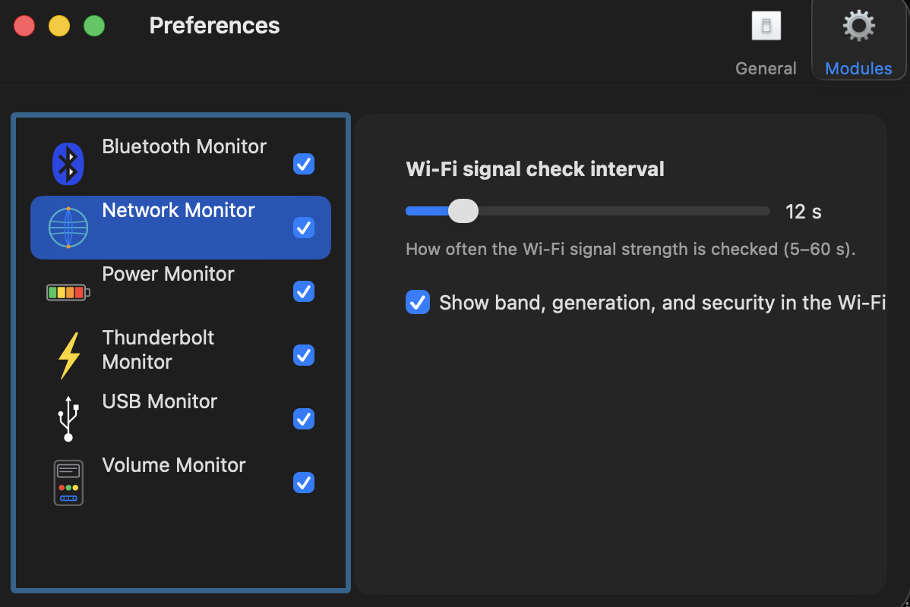

# HG4MAC

> **HG4MAC** ("HardwareGrowler for Mac") is a modernized fork of HardwareGrowler for
> macOS Tahoe (26) / Apple Silicon. App bundle id: `com.jensyleo.hg4mac`.

> ### 🍴 This is a fork
> This repository is a **fork** of
> **[pranav-prakash/HardwareGrowler-NC](https://github.com/pranav-prakash/HardwareGrowler-NC)**
> (itself based on **[Growl](https://github.com/growl/growl)**, © The Growl Project, LLC,
> BSD-licensed).
>
> **All of the modernization in this repository was done starting from that source** — it
> is derivative work built on top of it, not an original project. The upstream authors did
> the foundational work; this fork only updates it for current macOS. Full credit to them.

A macOS menu-bar app that shows native-style notifications when hardware changes —
volumes mount/unmount, USB and Thunderbolt devices connect, Wi-Fi/Ethernet links and
IP addresses change, Bluetooth devices pair, the power source / battery state changes,
and the Mac's thermal state shifts (throttling).

This **modernized fork** brings HardwareGrowler up to date for **macOS Tahoe (26) and
Apple Silicon**, starting from the upstream linked above.

> Built and tested on macOS 26 (Tahoe), Apple Silicon (M-series). Minimum deployment target: macOS 13.



---

## Features

- **Native-style notification banners** — a custom translucent panel
  (`NSVisualEffectView`) that:
  - shows a **per-notification colored icon** (not just the app icon),
  - **grows dynamically** to fit long titles/bodies (e.g. long volume names, multi-line IP info),
  - **stacks** multiple notifications vertically,
  - has a **close (×)** button and is **click-to-open** (e.g. reveal a mounted volume in Finder),
  - **highlights "before → after" changes in color** — any notification line written as
    `"Label:\told → new"` automatically gets its new value colored (accent blue/teal,
    bold) so what actually changed stands out at a glance, instead of having to re-read the
    whole line. Used by Thermal (state transitions), Display (resolution/refresh
    rate/rotation/role changes), and Power (AC/battery source changes).
- **Twelve hardware/system monitors** (loadable plugins):
  | Monitor | Reports |
  |---------|---------|
  | **Volume** | mount / unmount (with a Finder "click to open"), ignore-list picker, device-specific icon (SD card / USB drive / external disk) when Disk Arbitration reports enough signal to tell them apart, and the mounted volume's interface/reader type (e.g. "SD/CF card (integrated reader)" vs "SD/CF card (external reader)" vs a generic bus name), on by default |
  | **USB** | device connect / disconnect |
  | **Thunderbolt** | device connect / disconnect, plus an optional, off-by-default separate "eGPU Connected"/"eGPU Disconnected" notification when the hot-plugged device is a PCI Display Controller — see "Known limitations" for why eGPU *disconnect* often can't be detected |
  | **Network** | Wi-Fi connect/disconnect (SSID + BSSID via CoreWLAN, signal-strength icon, reported at launch too), Ethernet/interface link up/down + media speed/duplex, IPv4/IPv6 + CIDR + gateway, and an optional, off-by-default VPN connect/disconnect notice — see "Known limitations" for how this is detected and its caveats |
  | **Bluetooth** | device connect / disconnect |
  | **Power** | AC/battery transitions (with a colored "old → new" source line), a battery-level icon ramp (0–100), a charging-level ramp, time remaining / time-to-charge, periodic status refire, low-battery warning (announces "fully charged" once, no repeats), a separate Battery Health Check (cycle count / battery health %) with its own configurable interval, an optional more-frequent "Notify every" reminder (in hours or minutes) between full checks, a "Check Now" button to preview it on demand, and an optional, off-by-default Low Power Mode on/off notification |
  | **Thermal** | system thermal state changes (Nominal/Fair/Serious/Critical throttling) with a colored "old → new" transition line and an explicit "Cooling down"/"Warming up" direction tag, per-level notification toggles, and a "Simulate Test Notification" control (Preferences) to preview any state combination on demand — useful since many Macs rarely or never reach Serious/Critical under normal/moderate load. A separate module from **Power** by design (battery state and thermal/throttling state are shown independently), but reads from the same system power/process-info APIs (`NSProcessInfo`) as Power Monitor — noted here for traceability. |
  | **Display** | external display connect/disconnect (name, resolution, refresh rate, rotation, role), plus changes to an *already-connected* display's resolution, refresh rate, rotation, or role (Main/Extended/Mirrored) — each shown with a colored "old → new" line and independently toggleable. An optional, off-by-default experimental early physical-link detection is also available (see below). |
  | **Audio** | default output/default input device changes (with a colored "old → new" line, transport/channel count/sample rate detail), plus connect/disconnect for audio devices on transports USB/Bluetooth Monitor don't already cover (Built-in, HDMI, Thunderbolt, AirPlay, Aggregate) — see "Known limitations" below for why USB/Bluetooth audio devices are deliberately NOT re-reported here. |
  | **Camera** | connect/disconnect for cameras on transports USB/Bluetooth Monitor don't already cover (same filtering logic as Audio, see below), plus a privacy-relevant "camera started/stopped being used by any app" signal (via CoreMediaIO, the same fact macOS's own camera-in-use indicator reflects) — reading it requires no camera/TCC permission, since it's hardware-state observation, not frame capture. |
  | **Gamepad** | game controller connect/disconnect, vendor name, controller category (e.g. DualSense/Xbox/MFi), player index, and battery level — reported even when USB/Bluetooth Monitor also announced the same physical connect generically, since the GameController framework exposes no transport type to filter on, and the controller-specific detail (category/battery/player) is new information regardless. Only recognizes officially HID-compliant controllers (PS4/PS5/Xbox/MFi) — see "Known limitations". |
  | **Printer** (off by default) | printer added/removed, detected for USB, Bluetooth, and network (IPP/AirPrint/Bonjour) printers alike — see "Known limitations" for how detection works and its caveats |
- **Duplicate suppression** and **"unstable device"** detection (flags a device that
  rapidly connects/disconnects).
- **Modern macOS integration**: "Start at Login" via `SMAppService`, a custom-drawn
  colored menu-bar icon (`NSStatusItem.button`, not a template image — it keeps its own
  color and swaps light/dark variants with the menu bar's appearance), show-in-menu/dock/both/none,
  and a **clean Uninstall** that leaves no orphan files.

## What's modernized in this fork

- **Migrated from MRC to ARC** (per-file `-fobjc-arc`), incl. the CoreFoundation/IOKit
  `__bridge` boundaries; every migrated file was adversarially reviewed.
- **Removed dead/removed APIs** for macOS 13+/Apple Silicon: Carbon Process Manager
  (`ProcessSerialNumber`/`TransformProcessType` → `NSApp setActivationPolicy:`),
  `launchApplicationAtURL:` → `openApplicationAtURL:configuration:completionHandler:`,
  deprecated `NSAlert`/`NSStatusItem`/text-alignment constants, etc.
- **Wi-Fi via CoreWLAN + CoreLocation** (the old SCDynamicStore AirPort keys no longer
  fire on modern macOS); SSID requires Location permission.
- **Icons moved to an Asset Catalog** (`Assets.xcassets`) with colored artwork, and the
  notification banner now carries each notification's own icon.
- **Trimmed** monitors that no longer make sense (Time Machine, Phone, Keyboard;
  FireWire replaced by Thunderbolt).
- **Responsiveness**: App Nap disabled (`LSAppNapIsDisabled`) so the background agent
  isn't throttled and notifications fire promptly.
- **Reliability fixes** from a full static-analysis + review pass (clang analyzer clean):
  corrected IOKit name/iterator handling, thread-safety of CoreWLAN callbacks, power
  capacity guards, KVO balance, and more — see [`CHANGELOG.md`](CHANGELOG.md).
- Build warnings reduced from 44 to **0**.

See **[`CHANGELOG.md`](CHANGELOG.md)** for the full, itemized list of modernization work.

## Requirements

- macOS 13.0+ (developed/tested on macOS 26 Tahoe).
- Xcode (recent), Apple Silicon or Intel.

## Download

Prebuilt app: see [Releases](https://github.com/jensyleo/HG4MAC/releases/latest) for a
ready-to-run `.zip`. Or build it yourself:

## Build & install

```sh
# Build the app (Release)
xcodebuild -project HardwareGrowler.xcodeproj \
           -scheme HardwareGrowler \
           -configuration Release \
           -derivedDataPath build

# Install to /Applications (no sudo needed — /Applications is admin-writable)
pkill -x HG4MAC 2>/dev/null
rm -rf /Applications/HG4MAC.app
cp -R build/Build/Products/Release/HG4MAC.app /Applications/
open /Applications/HG4MAC.app
```

> You can also open `HardwareGrowler.xcodeproj` in Xcode and build the `HardwareGrowler`
> scheme. The app and its monitor plugins are bundled together; HardwareGrowler is one
> target within the larger Growl source tree this repo descends from.

## Known limitations

- **Ethernet duplex reporting can mismatch a switch's own view.** The app reads the link
  speed/duplex via the standard `SIOCGIFMEDIA` ioctl — the same data source `ifconfig`
  uses. On at least one tested setup (a managed/enterprise switch port forced to
  half-duplex), both this app **and** `ifconfig` reported "full-duplex" while the switch's
  own management console reported half-duplex. This is a mismatch between the actual PHY
  negotiation and what the network adapter's macOS driver surfaces to the OS — outside
  what any app can read via public APIs. Needs testing across more adapters/switches to
  tell whether it's specific to one driver/chipset or more general; treat reported duplex
  as informational, not authoritative, until then.

- **Display Monitor cannot report the physical connection type (HDMI/DisplayPort/USB-C/
  Thunderbolt) or the display's vendor/model via EDID.** Both live below any public API:
  connector type is only known to the GPU's display driver (`AGX`/`DCP` on Apple Silicon),
  which Apple does not expose to third-party apps at all. Vendor/model via EDID used to be
  reachable through `CGDisplayIOServicePort`, but that call has been deprecated since OS X
  10.9 and no longer resolves usefully on Apple Silicon's display pipeline. `NSScreen.localizedName`
  (used for the display's name in notifications) covers most of the same practical need,
  since macOS resolves it from EDID internally regardless.

- **Display Monitor detects a connection only once macOS assigns the display an
  arrangement (Extended or Mirror) — not at the instant the cable/HDMI link is raised**, by
  design (see "Experimental: early physical-link detection" below for the optional,
  off-by-default alternative and why it isn't the default path).

- **Switching between "Entire Screen" / "Window or App" / "Extended Display" on an
  already-connected external display does not fire a new notification. This is expected,
  not a bug.** Verified empirically (2026-07-19): `system_profiler SPDisplaysDataType`
  shows the external display disappear from the online list while "Entire Screen" or
  "Window or App" mirroring is active, then reappear once "Extended Display" is chosen —
  yet `CGGetOnlineDisplayList` (what Display Monitor reads) does not report a
  disconnect/reconnect across that transition, because the physical link never actually
  drops; only the render target changes. A real "Stop Mirroring" followed by picking a mode
  again does produce a genuine connect event and notifies normally.

- **Audio Monitor and Camera Monitor deliberately do NOT report connect/disconnect for
  USB or Bluetooth devices — this is expected, not a bug.** Both `AVCaptureDevice.transportType`
  (Camera) and CoreAudio's device transport property (Audio) reuse the same
  `kAudioDeviceTransportType*` constants, so both monitors check the transport of a
  newly-appeared device and skip firing their own "Connected"/"Disconnected" notification
  whenever it's USB or Bluetooth — because USB Monitor or Bluetooth Monitor *already*
  announced that same physical connect event generically. Reporting it again from Audio/Camera
  Monitor too would be the same real-world event described twice with no new information. The
  filter only suppresses the connect/disconnect axis specifically:
  - Audio Monitor's default-output/default-input-changed notifications still fire regardless
    of transport, since *which device macOS is actually using* is separate information from
    *that a device merely exists* — confirmed live with a Bluetooth speaker:
    connecting it produced Bluetooth Monitor's own "Bluetooth Connection" notification, no
    duplicate "Audio Device Connected", but still a legitimate "Default Output: MacBook Air
    Speakers → \<speaker name\>".
  - Camera Monitor's "started/stopped being used" notification also fires regardless of
    transport, for the same reason — it's not a connect event, so it can't be a duplicate of
    one.
  - Connect/disconnect notifications from Audio/Camera Monitor only ever fire for transports
    USB/Bluetooth Monitor don't cover: Built-in, HDMI, Thunderbolt, AirPlay, Aggregate. Testing
    this specifically requires that kind of hardware (e.g. a Continuity Camera iPhone over
    AirPlay, or an HDMI/Thunderbolt audio interface) — a USB webcam or a Bluetooth speaker will
    never trigger it, by design, no matter how the Preferences checkbox is set.

- **Gamepad Monitor always reports controller connect/disconnect, even when USB/Bluetooth
  Monitor also announced the same physical connect generically — this is intentional, not a
  missed duplicate filter.** Unlike Audio/Camera, the GameController framework (`GCController`)
  exposes no transport-type property to filter on, so there's no reliable way to suppress this
  case the same way. The design choice is to always
  show it anyway: the generic "USB/Bluetooth Device Connected: \<name\>" notification doesn't
  know the device is specifically a recognized game controller, its vendor/product category
  (DualSense/Xbox/MFi/etc.), player index, or battery level — genuinely new information even
  when the underlying connect event is the same one another monitor already reported.

- **Gamepad Monitor only recognizes controllers the GameController framework itself
  recognizes — a generic/third-party controller may never fire any notification at all,
  even though USB/Bluetooth Monitor sees it fine.** `GCController` only reports devices that
  implement the HID report descriptor for a profile it recognizes (Extended Gamepad, the
  profile official PS4/PS5/Xbox/MFi controllers implement) — it is not "any HID device that
  looks like a gamepad." Confirmed with a generic/off-brand USB
  controller: USB Monitor announced the connect normally (it only needs to know a USB HID
  device appeared), but Gamepad Monitor never fired "Game Controller Connected," and calling
  `+[GCController startWirelessControllerDiscoveryWithCompletionHandler:]` (required for the
  framework to route connect events to a background/menu-bar-only app like this one at all —
  without it, no controller of any kind is reported, not even genuinely-recognized ones)
  didn't change that. This is a macOS/GameController-framework limitation with non-official
  controllers, not something this app's code can work around; testing Gamepad Monitor
  requires an official PS4/PS5/Xbox/MFi controller.

- **eGPU detection (Thunderbolt Monitor, off by default) can usually detect CONNECT but
  not DISCONNECT.** An eGPU is inferred by checking whether a hot-plugged `IOPCIDevice` is a
  PCI "Display Controller" (base class `0x03`) — the same heuristic real eGPU enclosures
  enumerate as. On connect, the device's registry properties are still readable, so this
  works. On disconnect, IOKit's registry entry for the just-removed device is frequently
  already torn down by the time the removal callback fires (the same limitation that makes
  the generic Thunderbolt disconnect notification omit VID:PID/type info too) — so the eGPU
  class-code check silently fails and "eGPU Disconnected" often does not fire, even though
  the generic "Thunderbolt Disconnection" notification still does.

- **SD/CF card reader detection (Volume Monitor, on by default) cannot identify every
  reader — confirmed with a real USB card reader behind a hub.** Detection
  relies on Disk Arbitration reporting a "Secure Digital"-like signal in the device's
  protocol, media name, or model string. That specific reader/hub exposed the mounted card
  purely as a generic USB Mass Storage Class device — protocol `"USB"`, media name
  `"Untitled 1"`, model `"MassStorageClass"` — with no substring anywhere identifying it as a
  card reader. This is a real hardware/firmware limitation of that reader chipset, not a code
  bug: the reader's own USB Mass Storage firmware never reports card-specific identity to the
  OS, so there is nothing for Disk Arbitration (or any public API) to expose. The feature
  reliably works for a native **internal** SD controller (protocol reports "Secure Digital"
  directly) and for USB adapters whose specific chipset/firmware DOES surface an SD-related
  string — but this is not guaranteed for any given reader, and a plain "Interface: USB" line
  (or no line, if the "Interface" field's protocol is also generic) is the expected fallback
  for readers like this one.

  This same limitation applies to the device-type icon (SD card/pendrive/external
  disk) heuristic: confirmed with a real SD card in a USB adapter that
  reports media name `"STORAGE DEVICE"`, protocol `"USB"`, 63.9GB — no SD-related token
  anywhere. A brief attempt to plug this gap by assuming "any small unidentified USB Mass
  Storage device is a pendrive" was tried and reverted: it broke on this exact
  case, since there's no way to tell that situation apart from an actual unidentified
  pendrive using protocol alone. Genuinely unidentifiable USB Mass Storage (no card-reader
  token, no disk/drive token, under the external-disk size threshold) intentionally falls
  back to the plain generic mount icon — a wrong specific guess is worse than an honest
  generic one.

  The other side of this heuristic has a related caveat: the "≥400GB → External Disk" size
  rule is not fully future-proof either — pendrives larger than 400GB already exist on the
  market (e.g. 1TB USB 3.x flash drives), and one of those would be misclassified as an
  external disk by size alone. External disks still come out right in practice almost all
  the time (real external HDDs/SSDs are virtually always well above 400GB and rarely carry
  an identifying name token either), but this specific assumption is known to be imperfect
  and is a candidate for improvement (e.g. combining size with other signals) rather than a
  guaranteed-correct rule.

- **"Disk Not Readable" (Volume Monitor) cannot tell "deliberately unmounted, healthy disk"
  apart from "genuinely unreadable/corrupt disk" — confirmed with a real
  external HDD intentionally unmounted (via Finder/`diskutil unmount`) while
  left physically connected, then launching the app.** From Disk Arbitration's point of
  view both situations look identical at scan time: the physical disk is present, but has no
  mounted (or, in the fixed slow-auto-mount case, no yet-recognized) filesystem — there is no
  public API signal that distinguishes "this was deliberately unmounted" from "this never
  mounts because it's damaged." This is a permanent limitation of the detection approach, not
  a bug — if a disk is deliberately left unmounted-but-connected, expect a "Disk Not
  Readable" notice at the next app launch; it does not mean the disk is actually damaged.

- **VPN detection (Network Monitor, off by default) is a heuristic, not a definitive
  check.** There is no public macOS API that flags an interface as "this is a VPN." Detection
  works by watching for `utun*`/`ppp*`/`ipsec*` BSD interfaces gaining or losing an IPv4/IPv6
  address — the same virtual-interface naming macOS's own built-in VPN client and most
  third-party VPN apps (IKEv2/IPSec, WireGuard-based clients, legacy PPTP/L2TP) use. This can
  in principle also catch non-VPN system features that happen to use a `utun` interface (e.g.
  some Network Extension–based content filters), producing a false positive; there is no way
  to distinguish those from a real VPN with public API alone.

- **Printer Monitor (off by default) uses polling, not a push notification** —
  there is no public API for "the system's printer list changed" (CUPS/PMServer internals are
  private). It polls the CUPS destination list (`cupsGetDests()`, the same public C API
  `lpstat` is built on) every 3 seconds and diffs against the previous snapshot, so there can
  be a short delay before a connect/disconnect is reported. USB, Bluetooth, and network
  (IPP/AirPrint/Bonjour) printers are all detected the same way, since all three end up as
  CUPS destinations once added — but a **network printer is only detected once it has
  actually been added** in System Settings → Printers & Scanners, not merely because it's
  discoverable/reachable on the LAN (Bonjour advertisement alone isn't enough).
  - **Why not instant/event-driven**: an earlier attempt watched CUPS's own
    config file (`/etc/cups/printers.conf`) directly via a kqueue-backed `DispatchSource`,
    which would have been instant and fully idle between changes (no polling overhead at
    all). Confirmed via live testing that this silently detected nothing — that file is
    `-rw-------` (mode 600), owned by `root:_lp`, so a normal user process can't even `open()`
    it, let alone watch it. `cupsGetDests()` itself works fine without elevated privileges
    because it talks to `cupsd` over a local IPP socket rather than reading the config file
    directly. **This app will never request root/elevated privileges just to watch that one
    file faster** — 3-second polling is the fastest this can go while staying a normal,
    unprivileged user-space app. (If a future macOS version exposes the destination list via
    a proper Darwin notification/XPC push mechanism, this could be revisited.)

### Experimental: early physical-link detection (Display Monitor, off by default)

Display Monitor's normal detection (`CGGetOnlineDisplayList`) only sees a display once macOS
assigns it an arrangement (Extended or Mirror) — if the user dismisses macOS's own "how do
you want to use this display" prompt without choosing, nothing is detectable yet, because no
`CGDirectDisplayID` exists for that display until an arrangement is picked.

Investigated (2026-07-18) whether the earlier, physical-link-level event is reachable at
all: the **kernel itself logs it**, under the `DCPAVFamilyProxy`/`IOAVFamily` subsystems
(Apple Silicon's Display Co-Processor driver) — a real HDMI/DisplayPort hotplug produces an
`AppleDCPDPTXRemoteHDCPAuthSessionProxy` message sequence (`AuthOpen` → **`ReceiverConnected`**
→ `CPDesired` → `HPrimeAvailable`) the moment the physical link/HDCP handshake completes,
well before any CoreGraphics display object exists. This is reachable via the **public**
unified-logging read API (`OSLogStore`, available since macOS 10.15) with no special
entitlement — confirmed working from an unprivileged, ad-hoc-signed test binary, the same
signing model this app uses.

This is implemented as an **opt-in, off-by-default** feature in Display Monitor's
preferences ("Early physical-link detection (Experimental)"), with a 1–10 second polling
interval slider. **Read all of this before turning it on:**

- **Not a documented API.** What's being read is free-form kernel debug log text
  (`"ReceiverConnected"`, `IOAVFamily`, `DCPAVFamilyProxy`) with no stability contract of any
  kind. Apple can change the wording, rename the subsystem, or remove the logging entirely
  in any macOS update — silently, with no deprecation warning — and this feature would just
  stop firing (or start firing on the wrong thing) with no notice.
- **Continuous CPU/battery cost while enabled.** `OSLogStore` has no public push/streaming
  callback — only a historical enumerator — so catching this event requires **polling on a
  timer** for as long as the feature is on. Each poll scans every kernel log line since the
  last poll (which can be thousands of lines over a normal usage window) just to find the
  rare one that matches. This is genuine, ongoing overhead, not a one-time cost.
- **Apple Silicon only.** `DCPAVFamilyProxy` is the M-series Display Co-Processor proxy; an
  Intel Mac's kernel wouldn't log this at all, so the feature would simply never fire there.
- **Separate, clearly-labeled notification.** When it fires, it's its own "Video Link
  Detected (Experimental)" notification (off by default even if the plugin's default
  notification set is otherwise enabled) — never merged into or confused with the normal
  "Display Connected" notification, which remains the authoritative, non-experimental signal.

Recommended for testing/curiosity only. Given the cost/fragility trade-off above, it's
disabled by default and not expected to become the primary detection path.

## Permissions

On first launch macOS will ask for:
- **Bluetooth** — for the Bluetooth monitor.
- **Location** — required since macOS 10.14 to read the Wi-Fi **SSID** (the connection
  is still detected without it; only the network name needs it).

### Notifications & code signing

This build is signed **by the linker only** — the project sets `CODE_SIGN_IDENTITY = ""`,
so no `codesign` pass runs and the binary ends up *linker-signed* ad-hoc
(`flags=0x20002`). macOS does **not** register a linker-signed app with the system
Notification Center (`requestAuthorization` returns `UNErrorCodeNotificationsNotAllowed`),
so:

- The app **does not appear** under **System Settings → Notifications**, and
- it delivers alerts through its **own built-in banner** (the translucent `NSPanel`),
  which is why notifications still work and look native.

This is expected, not a bug — and **no Developer ID is required to change it**. Simply
signing the app **locally** is enough: a real ad-hoc signature via *"Sign to Run Locally"*
(`codesign -s -`, i.e. `CODE_SIGN_IDENTITY = "-"`) produces `flags=0x2 (adhoc)`, which macOS
**does** accept — the app then registers with the native Notification Center and appears in
the list. (This is exactly why a normally-built Xcode app shows up even without a paid
account.) The routing is automatic: if notification permission is granted it uses the native
center; otherwise it falls back to the built-in banner. This build intentionally keeps the
built-in banner.

## Uninstall

Click the menu-bar icon → **Uninstall HG4MAC…**. It unregisters the login item,
removes preferences/caches/saved-state, and moves the app to the Trash — no orphans left.

## Project layout

This repository is the Growl source tree; the modernized app lives in:

```
HardwareGrowler/            app delegate, main menu, status item, prefs window
GrowlStub/                  custom notification banner (GrowlApplicationBridge)
BluetoothMonitor/ NetworkMonitor/ PowerMonitor/ ThermalMonitor/ ThunderboltMonitor/
USBMonitor/ VolumeMonitor/
                            the seven monitor plugins (.hwgrowlmonitor bundles)
Resources/Assets.xcassets/  notification & preference icons
HardwareGrowler.xcodeproj/  the Xcode project
```

## Credits & license

This is a **fork** — the work here was built **on top of** the following sources, which
deserve the primary credit:

- **Upstream this fork is based on:**
  [`pranav-prakash/HardwareGrowler-NC`](https://github.com/pranav-prakash/HardwareGrowler-NC)
  — the Notification-Center rich-icon approach.
- **Original project:** **HardwareGrowler** and the Growl framework ©
  **The Growl Project, LLC** ([growl/growl](https://github.com/growl/growl)) — BSD license
  (see [`License.txt`](License.txt)).
- **This fork:** macOS Tahoe (26) / Apple Silicon modernization, 2026, by
  **Jensy Leonardo Martínez Cruz**.

This fork's own modifications and additions are licensed under the **GNU General Public
License v3.0 (GPLv3)** — see [`LICENSE`](LICENSE), © 2026 Jensy Leonardo Martínez Cruz.

It incorporates HardwareGrowler / Growl code © The Growl Project, LLC, which **remains under
its original BSD License** — see [`License.txt`](License.txt). That upstream code is **not
relicensed** (its license cannot be changed); the BSD notice is retained as required, and
BSD is GPL-compatible so the combined work is distributable under the GPLv3.

### Not affiliated
This is an independent, community-maintained fork. It is **not affiliated with, endorsed
by, or supported by** The Growl Project, LLC or the upstream author. "Growl" and
"HardwareGrowler" are used only to identify the upstream project from which this code
derives, under its BSD license.

### Trademarks
Notification icons depict standard hardware technologies. **Bluetooth®** is a registered
trademark of **Bluetooth SIG, Inc.**; **USB** is a trademark of the **USB Implementers
Forum, Inc.**; **Thunderbolt** is a trademark of **Intel Corporation**; **Wi-Fi®** is a
registered trademark of the **Wi-Fi Alliance**. These marks are used **only nominatively**,
to identify the technology being reported — no affiliation or endorsement is implied.
